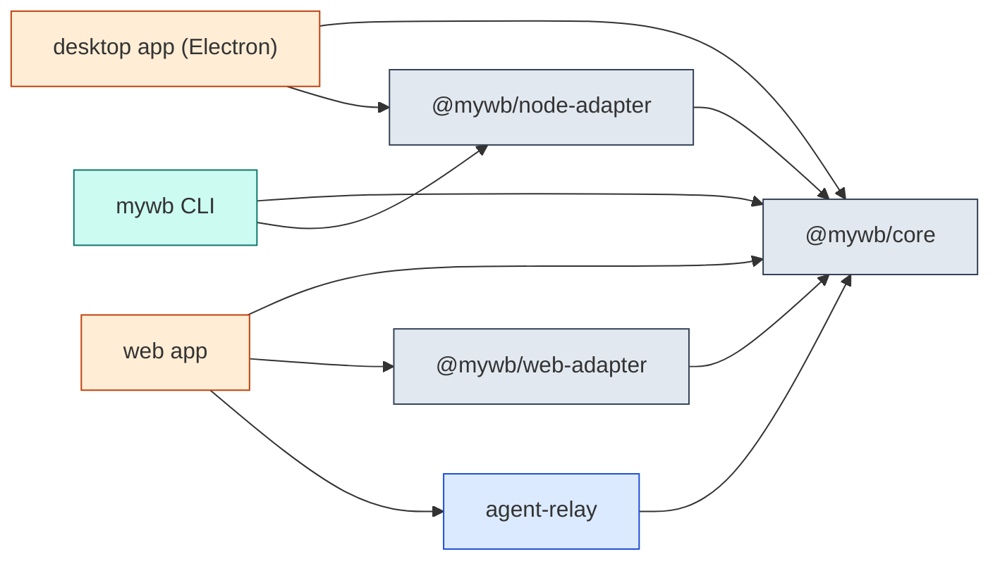

# My Whiteboard

Local-first whiteboard for engineers, built on the [tldraw SDK](https://tldraw.dev),
where coding agents are first-class users. Draw diagrams and wireframes, and let
Claude Code / Codex / Cursor / Gemini read and edit the canvas through a local API
— by structured data and code, not screenshots.

Desktop app (Electron), single-user, no server. Documents are portable `.mywb`
files. See [docs/product-positioning-abstract.md](docs/product-positioning-abstract.md).

## Develop

npm workspaces monorepo: `packages/core` (`@mywb/core`, environment-agnostic
core), `packages/node-adapter` (archive/sqlite + headless document access),
`apps/desktop` (Electron adapter), `apps/cli` (headless `mywb` CLI),
`apps/web` (web app), `services/agent-relay` (read-only gateway). CI drift-check template:
[examples/ci-drift-check/](examples/ci-drift-check/).

```bash
npm install
npm run dev        # launch the desktop app in dev
npm run typecheck  # tsc across all workspaces
npm test           # vitest: core (plain Node) + desktop
npm run e2e        # build + Playwright Electron e2e
npm run e2e:web    # apps/web: open/save .mywb round-trip (chrome channel)
npm run e2e:relay  # real browser tab ↔ relay ↔ agent read (Agent Gateway e2e)
npm run build:mac  # unsigned universal macOS DMG → apps/desktop/release/
```

> On a shell that exports `ELECTRON_RUN_AS_NODE=1`, prefix run commands with
> `env -u ELECTRON_RUN_AS_NODE` or the app launches as plain Node.

## What's inside

- **`.mywb` files** — zip archive containing a SQLite record store, embedded
  media, and an optional embedded `script/`. Every edit streams into a working
  copy for crash recovery; sessions restore on relaunch.
- **Agent API** — localhost HTTP server (`127.0.0.1:7236`) with a per-launch
  bearer token in `server.json`. `POST /api/search` reads canvas state;
  `POST /api/doc/:id/exec` runs code against the live editor; `GET /readme`
  documents it for an agent. Install the skill for your agents from
  **Help → Install Agent Skills…**.
- **MCP server** — `mywb mcp` (from `apps/cli`) exposes the running app's canvas
  as MCP tools (`list_documents`, `read_shapes` — full or summary detail,
  `read_bindings`, `screenshot`, `exec`, `scaffold_board`) so any MCP client
  connects with one command:
  `claude mcp add mywb -- node apps/cli/dist/cli.js mcp`.
- **Custom shapes** — `service-node`, `code-ref`, `mermaid-block` carry
  structured, agent-readable data for architecture and code-reference diagrams.
- **Document scripts** — `script/main.js` inside a file runs on open (after
  sha256-digest consent), enabling durable interactive behavior.

## Architecture

Rendered straight from this repo's own board — regenerate with
`node apps/cli/dist/cli.js file mermaid docs/architecture.mywb`:



See [docs/system-architecture.md](docs/system-architecture.md) and
[docs/codebase-summary.md](docs/codebase-summary.md). Roadmap (hybrid,
shared core): [docs/project-roadmap.md](docs/project-roadmap.md).

## Security note

The agent API and document scripts execute code by design (see the CSP note in
`src/renderer/index.html`). The boundaries are: the server binds loopback only
with a per-launch token, and embedded scripts run only after digest consent.
Only grant agent access and open `.mywb` files you trust.
