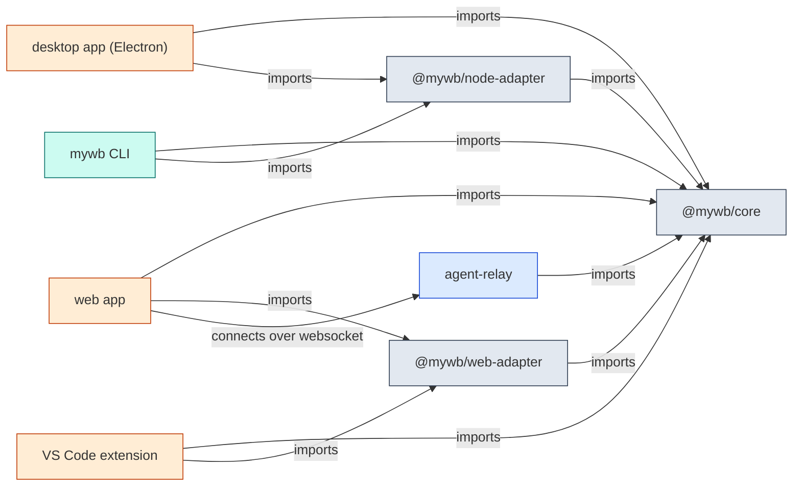

# My Whiteboard

[](https://github.com/phuc-nt/my-whiteboard/actions/workflows/ci.yml)

Local-first whiteboard for engineers, built on the [tldraw SDK](https://tldraw.dev),
where coding agents are first-class users. Draw diagrams and wireframes, and let
Claude Code / Codex / Cursor / Gemini read and edit the canvas through a local API
— by structured data and code, not screenshots.

Desktop app (Electron), single-user, no server. Documents are portable `.mywb`
files.

> **Status:** pre-1.0 (v0.1.0). Local-first desktop MVP is shipped; the web app
> and VS Code extension are functional. See the [changelog](CHANGELOG.md) and
> the [roadmap](docs/project-roadmap.md).

## Install

There are no pre-built binaries published yet — build from source (below). The
macOS and Linux desktop builds are produced by CI; a signed/released download is
planned (see the roadmap).

```bash
git clone https://github.com/phuc-nt/my-whiteboard.git
cd my-whiteboard
npm install
npm run dev         # launch the desktop app

npm run build:mac   # or: build an unsigned macOS DMG   → apps/desktop/release/
npm run build:linux # or: build a Linux AppImage + deb   → apps/desktop/release/
```

Requires **Node.js ≥ 22.12**. New contributors: see [CONTRIBUTING.md](CONTRIBUTING.md).

## Develop

npm workspaces monorepo: `packages/core` (`@mywb/core`, environment-agnostic
core), `packages/node-adapter` (archive/sqlite + headless document access),
`apps/desktop` (Electron adapter), `apps/cli` (headless `mywb` CLI),
`apps/web` (web app), `services/agent-relay` (read-only gateway). CI drift-check template:
[examples/ci-drift-check/](examples/ci-drift-check/).

```bash
npm install
npm run dev        # launch the desktop app in dev
npm run typecheck  # tsc across all workspaces
npm test           # vitest: core (plain Node) + desktop
npm run e2e        # build + Playwright Electron e2e
npm run e2e:web    # apps/web: open/save .mywb round-trip (chrome channel)
npm run e2e:relay  # real browser tab ↔ relay ↔ agent read (Agent Gateway e2e)
npm run build:mac  # unsigned universal macOS DMG → apps/desktop/release/
```

> On a shell that exports `ELECTRON_RUN_AS_NODE=1`, prefix run commands with
> `env -u ELECTRON_RUN_AS_NODE` or the app launches as plain Node.

## What's inside

- **`.mywb` files** — zip archive containing a SQLite record store, embedded
  media, and an optional embedded `script/`. Every edit streams into a working
  copy for crash recovery; sessions restore on relaunch.
- **Agent API** — localhost HTTP server (`127.0.0.1:7236`) with a per-launch
  bearer token in `server.json`. `POST /api/search` reads canvas state;
  `POST /api/doc/:id/exec` runs code against the live editor; `GET /readme`
  documents it for an agent. Install the skill for your agents from
  **Help → Install Agent Skills…**.
- **MCP server** — `mywb mcp` (from `apps/cli`) exposes the running app's canvas
  as MCP tools (`list_documents`, `read_shapes` — full or summary detail,
  `read_bindings`, `screenshot`, `export_svg`, `exec`, `scaffold_board`,
  `focus_shape`) so any MCP client
  connects with one command:
  `claude mcp add mywb -- node apps/cli/dist/cli.js mcp`.
- **Custom shapes** — `service-node`, `code-ref`, `mermaid-block` carry
  structured, agent-readable data for architecture and code-reference diagrams.
- **Model ⇄ board round-trip** — a board's architecture is also a small JSON
  model you can commit and review: `mywb file model extract <board>
  <board>.model.json` reads it out, and `mywb file scaffold <model> <board>
  --update` merges an edited model back in. The update keeps the layout, sizes
  and sticky notes a human added, so the model stays a living source of truth
  instead of a one-shot generator input.
- **VS Code extension** — open and edit `.mywb` boards on a full canvas inside
  VS Code ([apps/vscode](apps/vscode/README.md); build the `.vsix` with
  `npm run package:vsix -w apps/vscode`).
- **Document scripts** — `script/main.js` inside a file runs on open (after
  sha256-digest consent), enabling durable interactive behavior.

## Architecture

The canvas below is [`docs/architecture.mywb`](docs/architecture.mywb)
exported as pixel-true SVG — the real board, not a re-layout. Regenerate it
by running `npm run e2e` (the `generate-architecture-svg` spec) after editing
the board.



<details><summary>Same board as a Mermaid diagram (renders inline, headless-verifiable)</summary>

Regenerate with `node apps/cli/dist/cli.js file mermaid docs/architecture.mywb`:


```mermaid
flowchart LR
  n_mywb_core["@mywb/core"]:::lib
  n_mywb_node_adapter["@mywb/node-adapter"]:::lib
  n_mywb_web_adapter["@mywb/web-adapter"]:::lib
  n_desktop_app__Electron["desktop app (Electron)"]:::app
  n_mywb_CLI["mywb CLI"]:::tool
  n_web_app["web app"]:::app
  n_agent_relay["agent-relay"]:::api
  n_VS_Code_extension["VS Code extension"]:::app
  n_mywb_node_adapter -->|"imports"| n_mywb_core
  n_mywb_web_adapter -->|"imports"| n_mywb_core
  n_desktop_app__Electron -->|"imports"| n_mywb_core
  n_desktop_app__Electron -->|"imports"| n_mywb_node_adapter
  n_mywb_CLI -->|"imports"| n_mywb_core
  n_mywb_CLI -->|"imports"| n_mywb_node_adapter
  n_web_app -->|"imports"| n_mywb_core
  n_web_app -->|"imports"| n_mywb_web_adapter
  n_web_app -->|"connects over websocket"| n_agent_relay
  n_agent_relay -->|"imports"| n_mywb_core
  n_VS_Code_extension -->|"imports"| n_mywb_core
  n_VS_Code_extension -->|"imports"| n_mywb_web_adapter
  %% code-ref: packages/core/src/shapes/service-node/service-node-shape-util.tsx:8-8
  %% code-ref: apps/cli/src/cli-main.ts:15-38
  classDef api fill:#dbeafe,stroke:#1d4ed8
  classDef lib fill:#e2e8f0,stroke:#334155
  classDef app fill:#ffedd5,stroke:#c2410c
  classDef tool fill:#ccfbf1,stroke:#0f766e
```

</details>

See [docs/system-architecture.md](docs/system-architecture.md) and
[docs/codebase-summary.md](docs/codebase-summary.md). Roadmap (hybrid,
shared core): [docs/project-roadmap.md](docs/project-roadmap.md).

## Security note

The agent API and document scripts execute code by design (see the CSP note in
`src/renderer/index.html`). The boundaries are: the server binds loopback only
with a per-launch token, and embedded scripts run only after digest consent.
Only grant agent access and open `.mywb` files you trust. Full details and the
private disclosure process are in [SECURITY.md](SECURITY.md).

## License

Licensed under the [Apache License 2.0](LICENSE).

This project embeds the [tldraw SDK](https://tldraw.dev), which carries its own
license separate from this project's. Running only on localhost needs no tldraw
license key; deploying to a server with a domain is production use and requires
the operator to obtain their own key. This repository ships no key. See
[NOTICE](NOTICE) for the summary and
[docs/product-positioning-abstract.md](docs/product-positioning-abstract.md)
for the full rationale.
